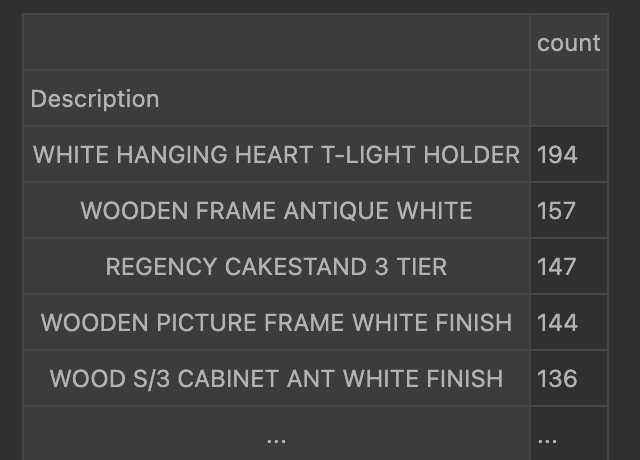

# **Online Retail Data Clustering - RFM (Recency, Frequency, Monetary) - CLV (Customer Lifetime Value)**

Credits: [Symson](https://www.symson.com/blog/customer-segments-for-profitable-pricing-a-complete-guide)

## Purpose of the Project
The primary goal of this project is to analyze online retail transaction data to identify distinct customer segments using RFM analysis. By understanding customer behaviors in terms of recency, frequency, and monetary value, we then can calculate Customer Lifetime Value (CLV) and develop targeted marketing strategies to enhance customer retention and profitability.

## Details on the Dataset
Data was sourced from the UC Irvine Machine Learning Repository.  
Link: [Online Retail II Dataset](https://archive.ics.uci.edu/dataset/502/online+retail+ii)

**Dataset Characteristics:**
- **Multivariate**
- **Sequential**
- **Time-Series**
- **Text**

**Subject Area:** Business, Retail  
**Associated Tasks:** Classification, Regression, Clustering, RFM, CLV 
**Feature Type:** Integer, Real  

### Additional Dataset Information
The Online Retail II dataset contains all transactions occurring for a UK-based registered, non-store online retail from 01/12/2009 to 09/12/2011. The company mainly sells unique all-occasion gift-ware, and many customers are wholesalers.

### Additional Variable Information
- **InvoiceNo:** Invoice number (Nominal). A unique 6-digit integral number assigned to each transaction. If it starts with 'c', it indicates a cancellation.
- **StockCode:** Product (item) code (Nominal). A unique 5-digit integral number assigned to each distinct product.
- **Description:** Product (item) name (Nominal).
- **Quantity:** The quantity of each product per transaction (Numeric).
- **InvoiceDate:** Invoice date and time (Numeric). The date and time when a transaction was generated.
- **UnitPrice:** Unit price (Numeric). Product price per unit in sterling (£).
- **CustomerID:** Customer number (Nominal). A unique 5-digit integral number assigned to each customer.
- **Country:** Country name (Nominal). The name of the country where a customer resides.

## Approach

### **1. Data Exploration**
- Conducted initial data exploration of the dataset, which contains 525,461 rows and 8 columns.
- Analyzed descriptive statistics.
- Investigated formatting issues, discrepancies, null values, and duplicates.

### **2. Data Cleaning**
- Cleaned the dataset by removing rows with null customer IDs.
- Dropped canceled orders from the analysis to ensure data integrity.

### **3. Feature Engineering**
- Engineered features for Frequency, Recency, and total spend by each customer.
- Removed outliers where necessary to refine the dataset.

**Data Prior to Removal of Outliers**  

**Data Post Removal of Outliers**

### **5. Customer Segmentation**
- Implemented K-means clustering to segment the customers based on engineered features.
- Used the Elbow Method to determine the optimal number of clusters (k).

The inertia was observed to decrease significantly at K = 4 and 5, with k = 4 having a higher silhouette score. The silhouette score ranges from [-1, 1], where higher values indicate more distinct clusters. 

**3D Scatter Plot of Customer Data by Cluster**  

### **6. Cluster Inferences**
To gain deeper insights, a more rigorous analysis was conducted using violin plots to examine the distribution of features across clusters.

1. **Cluster 0 (Blue): "Retain"**
   - **Rationale:** This cluster represents high-value customers who purchase regularly, though not always very recently. The focus should be on retention efforts to maintain their loyalty and spending levels.

   - **Action:** Implement loyalty programs, personalized offers, and regular engagement to ensure they remain active.

2. **Cluster 1 (Orange): "Re-Engage"**
   - **Rationale:** This group includes lower-value, infrequent buyers who haven’t purchased recently. The focus should be on re-engagement to bring them back into active purchasing behavior.

   - **Action:** Use targeted marketing campaigns, special discounts, or reminders to encourage them to return and purchase again.

3. **Cluster 2 (Green): "Nurture"**
   - **Rationale:** This cluster represents the least active and lowest-value customers, but they have made recent purchases. These customers may be new or need nurturing to increase their engagement and spending.

   - **Action:** Focus on building relationships, providing excellent customer service, and offering incentives to encourage more frequent purchases.

4. **Cluster 3 (Red): "Reward"**
   - **Rationale:** This cluster includes high-value, very frequent buyers, many of whom are still actively purchasing. They are your most loyal customers, and rewarding their loyalty is key to maintaining their engagement.

   - **Action:** Implement a robust loyalty program, provide exclusive offers, and recognize their loyalty to keep them engaged and satisfied.

### **7. Clustering Outliers and Inference**

- **Cluster -1 (Monetary Outliers) "PAMPER":**
  - **Characteristics:** High spenders but not necessarily frequent buyers. Their purchases are large but infrequent.
  - **Potential Strategy:** Focus on maintaining their loyalty with personalized offers or luxury services that cater to their high spending capacity.

- **Cluster -2 (Frequency Outliers) "UPSELL":**
  - **Characteristics:** Frequent buyers who spend less per purchase. These customers are consistently engaged but might benefit from upselling opportunities.
  - **Potential Strategy:** Implement loyalty programs or bundle deals to encourage higher spending per visit, given their frequent engagement.

- **Cluster -3 (Monetary & Frequency Outliers) "DELIGHT":**
  - **Characteristics:** The most valuable outliers, with extreme spending and frequent purchases. They are likely your top-tier customers who require special attention.
  - **Potential Strategy:** Develop VIP programs or exclusive offers to maintain their loyalty and encourage continued engagement.

### **8. Visualization**
- Analyzed all of the cluster distributions along with average feature values to derive insights.
  

### **9. Customer Lifetime Value (CLV)**

#### **Business Goals:**
In this section we will look to
1. Determine how much can be spent to acquire a customer.
2. Identify the most valuable customers.
3. Develop strategies to increase customer lifetime value.

#### **Three Parts of CLV Analysis**
- Descriptive CLV models
- Probabilistic CLV models
- Predictive CLV models

### **9.1. Part 1: Descriptive CLV Models**
   - **Model 1: Aggregation Models**
        - Aggregation models are used to calculate the average customer lifetime value for a group of customers or a cohort
        - We do that first by calculating customer-specific metrics such as the number of days between their first and last purchase, purchase frequency, and total/average sales.
        - We further need average churn rate helps understand customer retention issues, providing a high-level view of customer loyalty.
        - CLV Calculation Using Descriptive Method - Using the basic CLV equation(Lifespan Method)
        - Churn CLV Calculation and Lifetime CLV Calulation
        - Churn clv -This is essentially a customer lifetime value (CLV) calculation, adjusted for churn. It estimates how much profit a customer is expected to bring to the business before they churn.
        - Lifetime clv - This method estimates the Customer Lifetime Value (CLV) by calculating how much a customer will spend on average during their active lifetime, based on historical data.

Summary of Aggregation Model

###### So if we spend 100$ to acquire a customer to get 1220.29$ , that's a good business model but if we spend 1220.29$ or more to acquire a customer to get 1220.29$, then that's a bad business model

###### The Issue
The issue is the accuracy, do you believe that?
One way we can enhance this is by using cohort models
Adds more granularity, still not going to be perfect but it's still relatively easy to do

- **Model 2: Cohort models**
  - Cohort models are used to calculate the average customer lifetime value for a group of customers or a cohort.
  - Often times, the cohort is defined by the customer's first purchase date
  - Cohort analysis reveals how the behavior of customers changes over time, which can be used to develop targeted marketing and retention strategies for specific groups of customers.

Summary of Cohort Analysis 

##### Conclusions from the Aggregation models and Cohort models
We can't trust these Customer Lifetime Value (CLV) calculations. They are super optimistic for the churn calculation. Lifetime is a bit more realistic, but still has not earned my trust.
The bottom line is that as we get more granular, we can gain higher accuracy in our CLV calculations.
The next step is to build predictive models to forecast future customer lifetime values
CLV estimates that are overly optimistic (especially churn-based models) highlight the need for predictive modeling. Cohort-based lifetime estimates are more realistic, but businesses should refine their CLV calculation using more sophisticated models.

### **9.2 Part 2: Probabilistic CLV models**
Probabilistic models are used to predict the future transactions and churn rate of a customer
#### BG/NBD model
- The BG/NBD model is a probabilistic model that predicts the number of repeat purchases a customer will make
- BG/NBD model can only predict the future transactions and churn rate of a customer

Summary of BG/NBD model

#### Visualizing the probability alive matrix

If a customer has bought multiple times (frequency) and the time between the first & last transaction is high (receny), then his/her probability of being alive is high

#### GAMMA-GAMMA Model
- The Gamma-Gamma model is used to predict the average transaction value for each customer based on their frequency and monetary_value.
Profit Calculation- We add in profit margin (for example 0.15 or 15%)

Summary of Probabilistic model

#### Conclusions from the BG/NBD and Gamma-Gamma models
- Now we know how much we can spend to target these customers in the next 3 months
- Much better than the historical / descriptive models as it predicts the future transactions and churn rate of a customer
- However, we don't know what relationships exist between the features and the lifetime value of a customer, and therefore, we can't confidently improve the business
- The next step is to build predictive models to forecast future customer lifetime value and to understand the relationships between the features and the lifetime value of a customer

### **9.3 Part 3: Predictive CLV models**

We do this part to build predictive models to forecast future customer lifetime value and to understand the relationships between the features and the lifetime value of a customer

- Machine Learning is used for this 

1. What will the customers spend in the next 90-days? (Regression)
2. What is the probability of a customer to make a purcahse in next 90-days? (Classification)
Steps include
- Feature engineering
- Test-Train Splitting
- Model selection, training, testing, predicting
  - Using this we are able to predict the sales the next 90 days (Regression)
  - And also get the probability of a customer to make a purcahse in next 90-days (Classification)

- We can also infer which feature has imprtance for the CLV as well using SHAP

Regression Model

Classification Model

- Key business insights from SHAP

1. Increasing CLV 90-Day Sales Value
   - If we want to increase sales value, we should focus on the customers with the highest historical sales value and get them to spend more ( i.e. SalesLineTotal)
   
3. Increasing CLV 90-Day Sales Probability
   - If we want to increase the probability of a customer making a purchase in the next 90 days, we should focus on the customers with the highest frequency and and ensure they keep buying.

#### Increase FREQUENCY of purchases: sell them these

#### Increase SIZE of purchases: sell them these

- Now we know how much we can spend to target these customers in the next 3 months
- The regression models tells us how much they are going to spend, and the classification model tells us me whether or not they are falling off or churning over the next 90 days.
- We now also know what relationships exist between the features and the lifetime value of a customer and also the probability of a customer making a purchase over the next 90 days and therefore, we can confidently improve the business.

### **10. CLV for each Cluster**

Further Looking into CLV over the next 90 days for Each Cluster
- Using predictibe CLV models on each cluster, we now know the CLV 90-Day Sales Value of Customers in Each Cluster and how much can be spent to target them
- We also know the probability of a customer making a purchase in the next 90 days
- We aslo know the relationships between the features and the lifetime value of a customer

**Cluster 0: "Retain"**

Increasing CLV 90-Day Sales Value - If we want to increase sales value, we should focus on the customers with the highest historical total sales value and get them to spend more ( i.e. SalesLineTotal_sum)

Increasing CLV 90-Day Sales Probability - If we want to increase the probability of a customer making a purchase in the next 90 days, we should focus on the customers with the highest historical mean sales value and ensure they keep buying. (i.e. SalesLineTotal_mean)

**Cluster 1 "Re-Engage":**

Increasing CLV 90-Day Sales Value - If we want to increase sales value, we should focus on the customers with the highest historical total sales value and get them to spend more ( i.e. SalesLineTotal_sum)

Increasing CLV 90-Day Sales Probability - If we want to increase the probability of a customer making a purchase in the next 90 days, we should focus on the customers with the highest historical total sales value and get them to keep buying. ( i.e. SalesLineTotal_sum)

**Cluster 2 "Nurture":**

Increasing CLV 90-Day Sales Value - If we want to increase sales value, we should focus on the customers with the highest recency and get them to spend more ( i.e. recency)

Increasing CLV 90-Day Sales Probability - If we want to increase the probability of a customer making a purchase in the next 90 days, we should focus on the customers with the highest recency and ensure they keep buying. (i.e. recency)

**Cluster 3 "Reward":**

Increasing CLV 90-Day Sales Value - If we want to increase sales value, we should focus on the customers with the highest historical total sales value and get them to spend more ( i.e. SalesLineTotal_sum)

Increasing CLV 90-Day Sales Probability - If we want to increase the probability of a customer making a purchase in the next 90 days, we should focus on the customers with the highest historical total sales value and get them to keep buying. ( i.e. SalesLineTotal_sum)

**Cluster -1 (Monetary Outliers) "PAMPER":**

Increasing CLV 90-Day Sales Value - If we want to increase sales value, we should focus on the customers with the highest recency and get them to spend more ( i.e. recency)

Increasing CLV 90-Day Sales Probability - If we want to increase the probability of a customer making a purchase in the next 90 days, we should focus on the customers with the highest recency and ensure they keep buying. (i.e. recency)

**Cluster -2 (Frequency Outliers) "UPSELL":**

Increasing CLV 90-Day Sales Value - If we want to increase sales value, we should focus on the customers with the highest historical total sales value and get them to spend more ( i.e. SalesLineTotal_sum)

Increasing CLV 90-Day Sales Probability - If we want to increase the probability of a customer making a purchase in the next 90 days, we should focus on the customers with the highest recency and ensure they keep buying. (i.e. recency)

**Cluster -3 (Monetary & Frequency Outliers) "DELIGHT":**

Increasing CLV 90-Day Sales Value - If we want to increase sales value, we should focus on the customers with the highest historical total sales value and get them to spend more ( i.e. SalesLineTotal_sum)

Increasing CLV 90-Day Sales Probability - If we want to increase the probability of a customer making a purchase in the next 90 days, we should focus on the customers with the highest recency and ensure they keep buying. (i.e. recency)

### Hypothetical Gain From Predictions and Clustering

Further, we calculate the gain from the predictions of CLV and probability of churn.
Results for Cluster 0 is as follows:

This clearly shows us that there's 3X ROI from baseline, a 63\% cost reduction, and increased projected revenue, significantly improving customer targeting efficiency displaying to us the benefits of segmentation and predictive CLV models.

### Conclusion

- This project successfully executed customer segmentation using RFM (Recency, Frequency, Monetary) analysis, effectively categorizing customers into distinct clusters based on their purchasing behaviors. By calculating Customer Lifetime Value (CLV) through three different methods—aggregation, probabilistic modeling, and predictive CLV models—insights into the projected revenue from each cluster over the next 90 days were obtained.

- These findings provide a clear indication of how much can be invested in targeted marketing efforts for these customers in the upcoming three months. Additionally, the analysis reveals the relationships between various features and customer lifetime value, enabling the formulation of informed strategies for enhancing customer engagement and retention.

- With these insights, opportunities for personalized marketing campaigns and product recommendations can be identified, paving the way for improved customer loyalty and increased business profitability.
